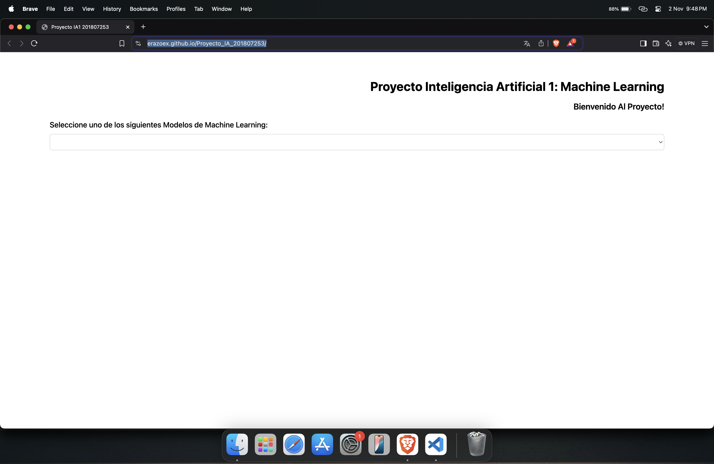
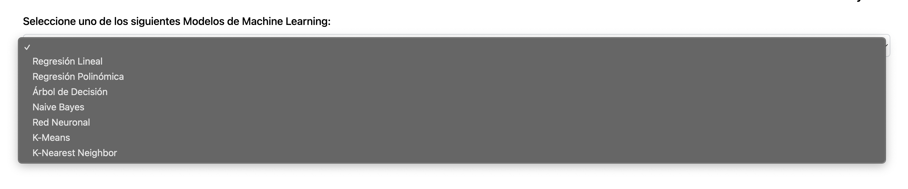
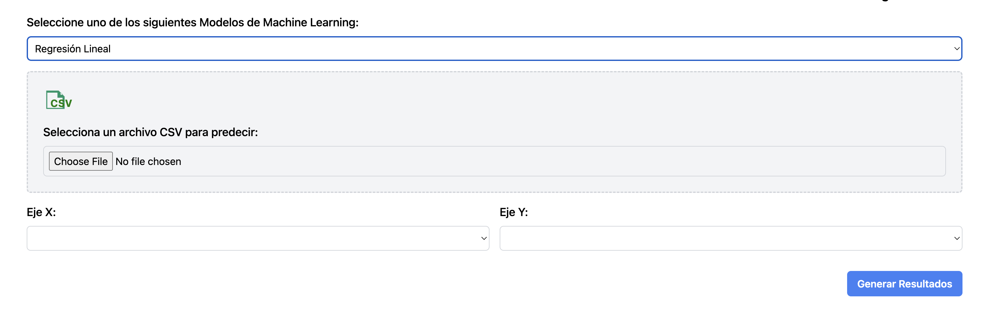
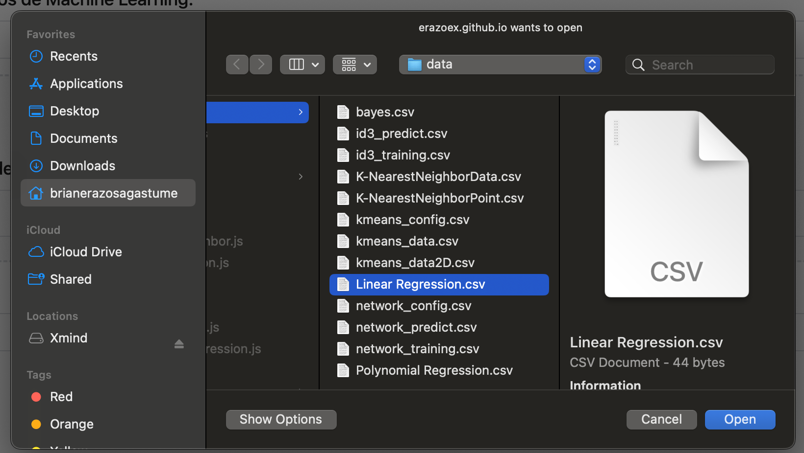
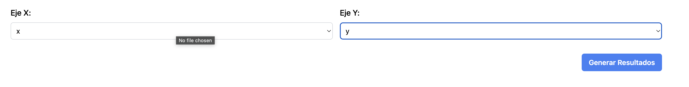
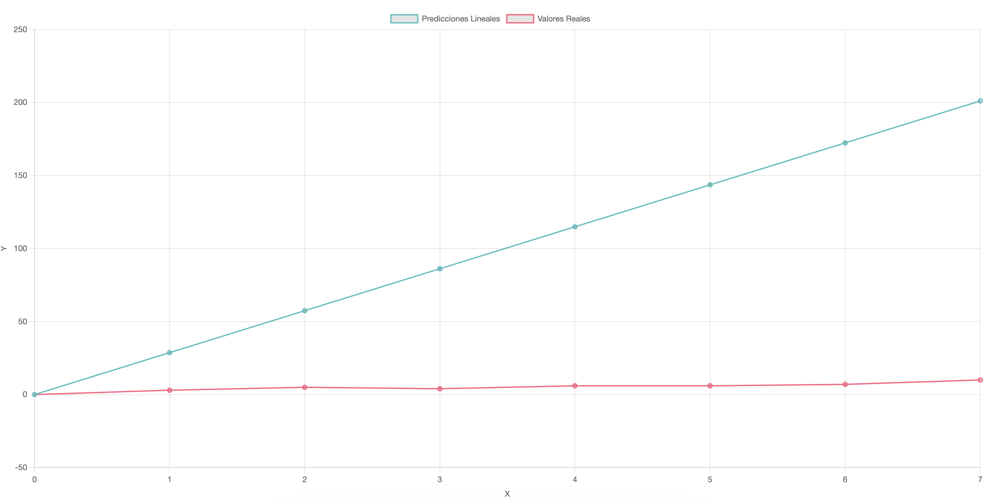

# Manual de Usuario

## 1. Introducción
Bienvenido al manual de usuario de Proyecto 2 de IA1. Este documento le proporcionará toda la información necesaria para comenzar a utilizar [Nombre del Producto/Software] de manera efectiva.

## 2. Guía de Uso
1. Al ingresar al sitio web `https://erazoex.github.io/Proyecto_IA_201807253/` se encontrara con lo siguiente:

2. Tendra la opcion de escoger entre diferentes modelos de **Machine Learning**

3. Al escoger cualquier modelo le aparecerá un componente para cargar archivos de tipo csv, este le indicará que tipo de archivo necesitará para continuar. Estos pueden ser de tipos configuración, entrenamiento y de predicción.

4. Al cargar el archivo aparecerán otras opciones que necesitarán de manipulación como pueden ser las dimensionales del modelo

5. Luego podrá darle al boton de generar resultados el cual mostrarán los datos correspondientes al modelo

6. Y ya está!, podrá utilizar cualquier modelo que se encuentre disponible ingresando los datos necesarios.
